# Prompt Engineering Guide

**Version**: 1.0
**Last Updated**: 2026-02-05
**Audience**: Users optimizing photo analysis quality

---

## Table of Contents

1. [Overview](#overview)
2. [Quick Start](#quick-start)
3. [Understanding Quality Metrics](#understanding-quality-metrics)
4. [Validation Workflow](#validation-workflow)
5. [Optimization Strategies](#optimization-strategies)
6. [A/B Testing](#ab-testing)
7. [Common Issues & Solutions](#common-issues--solutions)
8. [Advanced Techniques](#advanced-techniques)
9. [Best Practices](#best-practices)

---

## Overview

The Photo Open Call Analyzer uses AI (LLaVA vision model) to evaluate photographs against competition criteria. The quality of AI analysis depends heavily on **prompt engineering** - how you structure evaluation criteria and instructions.

This guide shows you how to:
- ✅ Validate criteria quality **before** running expensive analyses
- ✅ Optimize prompts iteratively using validation feedback
- ✅ Compare prompt variants objectively with A/B testing
- ✅ Detect and fix incoherent AI outputs

**Why this matters**:
- Poor prompts → generic feedback ("good composition", "nice lighting")
- Good prompts → actionable feedback ("widen aperture to f/2.8 for subject isolation")
- Validation → save 20-30 minutes by catching issues early

---

## Quick Start

### 1. Generate Analysis Prompt

```bash
npm run analyze analyze data/open-calls/wildlife-2026/
```

This automatically:
- Detects competition type (e.g., wildlife, portrait)
- Selects appropriate template
- Generates evaluation criteria
- **Validates quality** (new in M2)
- Saves to `analysis-prompt.json`

### 2. Review Validation Report

```
═══════════════════════════════════════════════
         PROMPT QUALITY VALIDATION REPORT
═══════════════════════════════════════════════

Overall Status: [FAIL] ✗

Quality Scores:
  Specificity:  4.2/10 ████░░░░░░
  Alignment:    6.5/10 ███████░░░
  Overall:      5.4/10 █████░░░░░

Issues Found:
  🔴 HIGH (2):
     • Criterion "Quality" is too generic
     • Criterion "Impact" is too vague

  🟡 MEDIUM (1):
     • Total weight is 105%, should be 100%

Suggestions:
  1. Replace "Quality" with "Technical Excellence" or "Image Sharpness"
  2. Replace "Impact" with "Emotional Resonance" or "Visual Storytelling"

═══════════════════════════════════════════════

Recommendation: Regenerate prompt with refined criteria
```

### 3. Fix Issues

**Option A: Regenerate with specific template**
```bash
npm run analyze analyze data/open-calls/wildlife-2026/ --template wildlife
```

**Option B: Manually edit** `analysis-prompt.json`

**Option C: Validate again**
```bash
npm run analyze validate-prompt data/open-calls/wildlife-2026/
```

### 4. Proceed with Analysis

Once validation passes (score ≥7/10):
```bash
npm run analyze analyze data/open-calls/wildlife-2026/ --analysis-mode multi
```

---

## Understanding Quality Metrics

### Specificity Score (0-10)

**What it measures**: How actionable and photography-specific your criteria are.

**Scoring**:
- **Base**: 5/10 (neutral)
- **Generic terms** (-2 each): "quality", "good", "nice", "beautiful"
- **Photography terms** (+1 each): "bokeh", "leading lines", "rule of thirds", "golden hour"
- **Actionable phrases** (+1 each): "adjust aperture", "increase contrast", "warm color palette"

**Examples**:

❌ **Low Specificity (3/10)**:
```json
{
  "name": "Quality",
  "description": "Good overall quality",
  "weight": 50
}
```
Problems: Generic name, vague description, no actionable guidance

✅ **High Specificity (9/10)**:
```json
{
  "name": "Technical Excellence",
  "description": "Sharp focus on subject's eyes, proper exposure without blown highlights, accurate white balance for natural skin tones",
  "weight": 30
}
```
Strengths: Specific name, measurable aspects, photography terminology

---

### Alignment Score (0-10)

**What it measures**: How well criteria match the competition theme.

**Calculation**:
```
alignment = (matchedKeywords / expectedKeywords) × 10
```

**Examples**:

**Wildlife Competition Theme**: "Animal Behavior in Natural Habitat"
- Expected keywords: "behavior", "animal", "habitat", "natural", "interaction"

❌ **Poor Alignment (4/10)**:
```json
[
  { "name": "Composition", "description": "Rule of thirds applied" },
  { "name": "Lighting", "description": "Good exposure" },
  { "name": "Color", "description": "Vibrant colors" }
]
```
Missing: behavior, habitat, natural setting

✅ **Good Alignment (8/10)**:
```json
[
  { "name": "Behavioral Significance", "description": "Captures meaningful animal behavior in natural setting" },
  { "name": "Habitat Context", "description": "Shows animal's relationship with natural environment" },
  { "name": "Technical Quality", "description": "Sharp focus on subject, natural lighting" }
]
```
Includes: behavior, natural, habitat, environment

---

### Overall Score

```
overall = (specificity × 0.6) + (alignment × 0.4)
```

**Interpretation**:
- **9-10**: Excellent, ready for analysis
- **7-8**: Good, minor improvements possible
- **5-6**: Mediocre, regeneration recommended
- **0-4**: Poor, definitely regenerate

---

## Validation Workflow

### Standard Workflow

```mermaid
graph TD
    A[Generate Prompt] --> B{Auto-Validation}
    B -->|Pass ≥7/10| C[Proceed with Analysis]
    B -->|Fail <7/10| D[Review Issues]
    D --> E{Fix Method?}
    E -->|Regenerate| F[Use Template Flag]
    E -->|Manual Edit| G[Edit JSON]
    E -->|Validate Again| H[Run validate-prompt]
    F --> B
    G --> H
    H --> B
    C --> I[Batch Analysis]
    I --> J[Coherence Check]
    J -->|Issues Found| K[Review Incoherent Results]
    J -->|All OK| L[Export Results]
```



### Manual Validation Command

```bash
# Validate existing prompt
npm run analyze validate-prompt data/open-calls/wildlife-2026/

# Verbose mode (show all issues including low severity)
npm run analyze validate-prompt data/open-calls/wildlife-2026/ --verbose

# Skip auto-fix suggestions
npm run analyze validate-prompt data/open-calls/wildlife-2026/ --no-auto-fix
```

---

## Optimization Strategies

### Strategy 1: Template Selection

**Problem**: Generic criteria for specific competition types

**Solution**: Explicitly specify template

```bash
# Detect automatically (default)
npm run analyze analyze data/open-calls/nature-2026/

# Force specific template
npm run analyze analyze data/open-calls/nature-2026/ --template landscape
```

**Available templates**:
- `portrait` - Face photography, expression, lighting
- `landscape` - Nature, atmosphere, composition
- `wildlife` - Animal behavior, habitat, natural setting
- `conceptual` - Originality, symbolism, artistic vision
- `documentary` - Storytelling, authenticity, social impact
- `generic` - Fallback for other types

**When to override**:
- Ambiguous themes (e.g., "Connection" → portrait or documentary?)
- Mixed genres (e.g., "Wildlife Portraits" → wildlife template)
- Auto-detection incorrect (check validation report)

---

### Strategy 2: Iterative Refinement

**Problem**: Validation fails with multiple issues

**Approach**: Fix iteratively, validate each step

**Example Workflow**:

**Iteration 1**: Initial generation
```bash
npm run analyze analyze data/open-calls/test/
# Specificity: 4.5/10 (3 generic terms)
```

**Iteration 2**: Regenerate with template
```bash
npm run analyze analyze data/open-calls/test/ --template portrait
# Specificity: 6.8/10 (1 generic term)
```

**Iteration 3**: Manual edit `analysis-prompt.json`
```json
// Before:
{ "name": "Technical Quality", "description": "Good technical quality" }

// After:
{ "name": "Technical Excellence", "description": "Sharp focus on eyes, balanced exposure, accurate skin tones" }
```

**Iteration 4**: Validate
```bash
npm run analyze validate-prompt data/open-calls/test/
# Specificity: 8.5/10 ✓
```

**Result**: 4 iterations, ~5 minutes total, high-quality prompt

---

### Strategy 3: Learning from Past Winners

**Problem**: Criteria don't reflect competition's priorities

**Solution**: Include past winner analysis in open-call.json

```json
{
  "title": "World Press Photo 2026",
  "theme": "Stories of Resilience",
  "pastWinners": "Past winners emphasized: raw emotion, decisive moment, contextual storytelling, ethical approach to sensitive subjects",
  "jury": ["Jury info..."]
}
```

**Effect**: Alignment score incorporates past winner keywords:
- "emotion" → Emotional Impact criterion
- "decisive moment" → Timing & Composition
- "contextual storytelling" → Narrative Context

---

## A/B Testing

### When to Use A/B Testing

Use when you want to objectively compare two prompt approaches:
- ✅ Testing manual improvements vs. template-generated
- ✅ Comparing two templates (portrait vs. conceptual)
- ✅ Evaluating refined criteria vs. original
- ✅ Testing different jury style instructions

**Don't use for**:
- ❌ Final analysis (too slow, only for testing)
- ❌ Single prompt evaluation (use `validate-prompt` instead)

---

### A/B Test Workflow

**Step 1: Create variant**

```bash
# Generate baseline
npm run analyze analyze data/open-calls/test/

# Manual edits to improve specificity
cp data/open-calls/test/analysis-prompt.json prompts/variant-improved.json
# Edit variant-improved.json...

# Or generate with different template
npm run analyze analyze data/open-calls/test/ --template wildlife
mv data/open-calls/test/analysis-prompt.json prompts/variant-wildlife.json
```

**Step 2: Run comparison**

```bash
npm run analyze test-prompt \
  --baseline prompts/baseline.json \
  --variant prompts/variant-improved.json \
  --photos data/open-calls/test/photos/ \
  --sample 5
```

**Sample size guidance**:
- `--sample 3`: Quick test (~3 minutes)
- `--sample 5`: Standard (~5 minutes)
- `--sample 10`: Thorough (~10 minutes)

**Step 3: Review results**

```
═══════════════════════════════════════════════
              A/B TESTING REPORT
═══════════════════════════════════════════════

Photos Analyzed: 5
Baseline Success Rate: 100%
Variant Success Rate: 100%

Metrics Comparison
━━━━━━━━━━━━━━━━━━━━━━━━━━━━━━━━━━━━━━━━━━━━━

| Metric          | Baseline | Variant | Delta   |
|-----------------|----------|---------|---------|
| Avg Score       | 7.2      | 7.5     | +0.3    |
| Std Dev         | 1.8      | 1.2     | -0.6    | ← Better
| Coherence Rate  | 80%      | 100%    | +20%    | ← Better
| Feedback Length | 420      | 580     | +160    | ← Better

Winner: VARIANT (Confidence: HIGH)
Points: Baseline 0, Variant 6

Recommendations:
  ✓ Variant shows better score consistency (lower std dev)
  ✓ Variant produces more coherent analyses
  ✓ Variant generates more detailed feedback

Adopt variant for production analysis.
```

---

### Interpreting A/B Results

**Winner Scoring System**:
- **Consistency** (3 points): Lower standard deviation = better
- **Coherence** (2 points): Higher % passing coherence checks = better
- **Detail** (1 point): Longer feedback = more detailed = better

**Confidence Levels**:
- **High**: Point difference ≥2 → Winner is reliable
- **Low**: Point difference <2 → Inconclusive, need more samples or variants are equivalent

**Score Delta Warnings**:
- `|Δscore| > 1.0`: Significant change, check if variant is too lenient/harsh
- Example: Baseline 7.2 → Variant 9.1 (+1.9) → "⚠️ Variant may be too lenient"

**What to do with results**:
- **High confidence winner** → Adopt variant, update project
- **Low confidence** → Increase sample size (`--sample 10`) or refine more
- **Tied** → Variants are equivalent, choose simpler one

---

## Common Issues & Solutions

### Issue 1: Generic Criteria Names

**Symptom**: Validation flags "Quality", "Impact", "Technical" as too generic

**Why it's bad**:
- LLM interprets generically ("Quality" → everything)
- User gets vague feedback
- Hard to compare photos objectively

**Solutions**:

❌ **Generic**:
```json
{ "name": "Quality", "description": "Overall quality of the image" }
```

✅ **Specific**:
```json
{ "name": "Technical Excellence", "description": "Sharp focus, proper exposure, color accuracy" }
```

✅ **Even Better** (domain-specific):
```json
{ "name": "Focus & Depth Control", "description": "Tack-sharp focus on subject's eyes, intentional bokeh for background separation" }
```

---

### Issue 2: Weight Normalization

**Symptom**: "Total weight is 105%, should be 100%"

**Why it happens**:
- LLM generates weights that don't sum to 100
- Rounding errors during generation

**Solution**: Auto-fix enabled by default

```bash
# Validation automatically normalizes weights
npm run analyze validate-prompt data/open-calls/test/

# Manual check:
# Open analysis-prompt.json
# Verify: Σ(weights) = 100
```

**Manual formula**:
```
normalized_weight = (original_weight / total_weight) × 100
```

Example:
- Original: 30, 35, 40 → Total 105
- Normalized: 28.6, 33.3, 38.1 → Total 100

---

### Issue 3: Score Incoherence

**Symptom**: After analysis, report shows incoherent results

```
Coherence Check Summary:
  Total Photos: 50
  Coherent: 45
  Incoherent: 5 ⚠️

Photo: portrait-023.jpg
  Issue: Weighted average mismatch
    Expected: 7.5, Got: 3.2
  Reasoning contains positive language but low score
```

**Why it happens**:
- LLM makes calculation errors
- Prompt instructions unclear
- Temperature too high (rare with multi-stage)

**Solutions**:

**1. Check individual photo**:
```bash
cat {project}/results/latest/portrait-023.json  # FR-3.12: use latest symlink
# Review scores.individual vs scores.summary
```

**2. Re-analyze with multi-stage** (if used single-stage):
```bash
npm run analyze analyze data/open-calls/test/ --analysis-mode multi
```

**3. Adjust prompt** if systematic issue:
```json
{
  "title": "Portrait Evaluation",
  "criteria": [...],
  "analysisInstructions": "IMPORTANT: Calculate weighted average as: (score1×weight1 + score2×weight2 + ...) / 100"
}
```

---

### Issue 4: High Score Variance

**Symptom**: Standard deviation >3.0 across criteria

**Example**:
```
Photo: wildlife-012.jpg
  Criterion 1 (Behavior): 10/10
  Criterion 2 (Lighting): 2/10
  Criterion 3 (Composition): 9/10
  Criterion 4 (Context): 2/10
  → σ = 4.2 (high variance!)
```

**Why it's problematic**:
- Indicates inconsistent evaluation
- Hard to trust overall score
- May reflect unclear criteria

**Solutions**:

**1. Check if variance is legitimate**:
- Some photos legitimately excel in one area, fail in another
- Review full_analysis text for reasoning

**2. If systematic, refine criteria**:
- Criteria may be too narrow or overlapping
- Example: "Lighting" + "Technical Quality" both evaluate exposure

**3. Re-analyze with Stage 3 consistency check**:
```bash
npm run analyze analyze data/open-calls/test/ --analysis-mode multi
```
Multi-stage includes consistency review that reduces variance.

---

## Advanced Techniques

### Technique 1: Custom Few-Shot Examples

**Purpose**: Guide LLM with examples of good vs. bad criteria

**Location**: `src/prompts/template-library.js`

**How to add**:

```javascript
export const FEW_SHOT_CRITERIA_EXAMPLES = [
  {
    competitionType: 'wildlife',
    theme: 'Animal Behavior',
    goodCriteria: {
      criteria: [
        {
          name: "Behavioral Significance",
          description: "Captures meaningful animal behavior (feeding, mating, territorial display) in natural setting",
          weight: 35
        }
      ],
      reasoning: "Specific, measurable, uses domain terms (territorial display), clear evaluation target"
    },
    badCriteria: {
      criteria: [
        {
          name: "Quality",
          description: "Good quality photo of animal",
          weight: 50
        }
      ],
      reasoning: "Generic name, vague description, excessive weight on single criterion"
    }
  }
  // Add your own...
];
```

**Effect**: LLM sees these examples when generating criteria, mimics good structure.

---

### Technique 2: Jury Style Context

**Purpose**: Reflect specific jury preferences in analysis tone

**How to use**:

```json
{
  "title": "World Press Photo 2026",
  "theme": "Stories of Resilience",
  "jury": [
    {
      "name": "Jane Smith",
      "bio": "Prefers raw, unmanipulated images. Values emotional authenticity over technical perfection.",
      "style": "critical, values emotion"
    }
  ]
}
```

**Effect**: Analysis emphasizes emotional impact, mentions technical issues but doesn't weight heavily.

**CLI flag** (future):
```bash
npm run analyze analyze data/open-calls/test/ --jury-style critical
```

---

### Technique 3: Temperature Tuning

**Purpose**: Control creativity vs. consistency tradeoff

**Current defaults** (optimized):
- Criteria generation: 0.3 (consistent, structured)
- Stage 1 (understanding): 0.4 (descriptive)
- Stage 2 (scoring): 0.2 (objective)
- Stage 3 (consistency): 0.3 (balanced)

**How to override** (requires code modification):

```javascript
// src/analysis/photo-analyzer.js
const stages = buildMultiStagePrompts(analysisPrompt, {
  stage1: { temperature: 0.5 },  // More creative descriptions
  stage2: { temperature: 0.1 },  // Very consistent scoring
  stage3: { temperature: 0.3 }   // Default
});
```

**When to adjust**:
- Increase stage1 temp (→0.5): Want more poetic/creative descriptions
- Decrease stage2 temp (→0.1): Experiencing score inconsistency
- Never exceed 0.5 for any stage (too much variance)

---

## Best Practices

### ✅ Do's

1. **Always validate before batch analysis**
   ```bash
   npm run analyze validate-prompt <dir>
   ```

2. **Use specific templates when applicable**
   ```bash
   --template portrait  # Not generic
   ```

3. **Review validation reports thoroughly**
   - Don't ignore warnings
   - Fix high/medium severity issues
   - Consider low severity suggestions

4. **A/B test significant changes**
   - Before committing to new approach
   - Use sample size ≥5 for reliable results

5. **Check coherence after batch analysis**
   - Review summary at end
   - Investigate incoherent results

6. **Iterate on criteria**
   - Generate → Validate → Refine → Validate
   - Track improvement in overall score

7. **Document prompt decisions**
   - Save variants with descriptive names
   - Note what worked/didn't work

---

### ❌ Don'ts

1. **Don't skip validation**
   - "I'll just run it, it's probably fine" → Waste 30 minutes

2. **Don't ignore coherence warnings**
   - Incoherent results indicate prompt problems
   - Fix root cause, don't just re-run

3. **Don't trust single A/B test with low confidence**
   - Increase sample size or refine more
   - Low confidence = inconclusive

4. **Don't over-optimize**
   - Specificity 8/10 is good enough
   - Chasing 10/10 has diminishing returns

5. **Don't use too many criteria**
   - 4-6 criteria optimal
   - >8 criteria → confusion, overlap

6. **Don't manually calculate weighted averages**
   - Auto-normalization handles it
   - Focus on criterion quality

7. **Don't reuse prompts across very different competitions**
   - Wildlife prompt ≠ Portrait prompt
   - Regenerate or at least re-validate

---

## Cheat Sheet

### Quick Reference Commands

```bash
# Generate + validate
npm run analyze analyze <dir>

# Validate existing
npm run analyze validate-prompt <dir>

# Verbose validation
npm run analyze validate-prompt <dir> --verbose

# Force template
npm run analyze analyze <dir> --template <type>

# A/B test
npm run analyze test-prompt \
  --baseline <file1> \
  --variant <file2> \
  --photos <dir> \
  --sample <n>

# Analysis modes
npm run analyze analyze <dir> --analysis-mode single  # Fast
npm run analyze analyze <dir> --analysis-mode multi   # Quality (default)
```

---

### Quality Score Targets

| Score | Interpretation | Action |
|-------|---------------|--------|
| 9-10 | Excellent | Proceed with confidence |
| 7-8 | Good | Minor tweaks optional |
| 5-6 | Mediocre | Regenerate or refine |
| 0-4 | Poor | Must regenerate |

---

### Template Selection Guide

| Competition Type | Use Template | Key Focus |
|-----------------|--------------|-----------|
| Face/people close-up | `portrait` | Expression, connection, lighting |
| Nature/scenery | `landscape` | Atmosphere, light quality, composition |
| Animals in habitat | `wildlife` | Behavior, natural setting, timing |
| Artistic/symbolic | `conceptual` | Originality, meaning, execution |
| Social issues | `documentary` | Story, authenticity, impact |
| Mixed/unclear | `generic` | Balanced criteria |

---

## Troubleshooting

### Problem: Validation always fails

**Possible causes**:
- Truly poor criteria (check suggestions)
- Validation too strict (false positives)
- Open call config missing (affects alignment)

**Debug steps**:
1. Run with `--verbose` to see all issues
2. Check alignment score separately:
   - Is `open-call.json` present?
   - Does theme contain relevant keywords?
3. Test with known-good prompt:
   ```bash
   cp examples/good-prompt.json test/analysis-prompt.json
   npm run analyze validate-prompt test/
   ```

---

### Problem: A/B test shows no winner (tie)

**Possible causes**:
- Variants truly equivalent
- Sample size too small
- Metrics don't capture your priorities

**Solutions**:
1. Increase sample: `--sample 10`
2. Check raw metrics in report JSON:
   ```bash
   cat ab-test-report.json | jq '.comparison'
   ```
3. Manual review: Analyze same photo with both, compare feedback quality

---

### Problem: Multi-stage too slow

**Typical timing**:
- Single-stage: 20-30 sec/photo
- Multi-stage: 30-45 sec/photo

**If slower**:
- Check Ollama performance: `ollama ps`
- Reduce max_tokens in photo-analyzer.js
- Use single-stage for large batches:
  ```bash
  npm run analyze analyze <dir> --analysis-mode single
  ```

---

## Examples Gallery

### Example 1: Wildlife Competition

**Theme**: "Animal Behavior in Natural Habitat"

**Good Criteria** (Specificity: 8.5/10):
```json
{
  "criteria": [
    {
      "name": "Behavioral Significance",
      "description": "Captures meaningful animal behavior (feeding, mating, territorial display, parenting) showing natural instincts in action",
      "weight": 35
    },
    {
      "name": "Habitat Integration",
      "description": "Subject is clearly part of natural environment, not isolated. Shows relationship between animal and habitat (shelter, food source, territory)",
      "weight": 25
    },
    {
      "name": "Technical Excellence",
      "description": "Sharp focus on critical areas (eyes, face), proper exposure maintaining detail in highlights and shadows, natural lighting without flash",
      "weight": 25
    },
    {
      "name": "Compositional Impact",
      "description": "Effective use of negative space to emphasize behavior. Subject positioning guides viewer attention. Background supports rather than distracts",
      "weight": 15
    }
  ]
}
```

---

### Example 2: Portrait Competition

**Theme**: "Authentic Human Connection"

**Good Criteria** (Specificity: 9.0/10):
```json
{
  "criteria": [
    {
      "name": "Emotional Authenticity",
      "description": "Genuine expression revealing inner emotional state. Not posed or forced. Eyes show connection and depth. Micro-expressions visible",
      "weight": 40
    },
    {
      "name": "Lighting Quality",
      "description": "Light sculpts face to reveal character. Intentional use of shadows. Catchlights in eyes create life. Skin tones are natural and flattering",
      "weight": 30
    },
    {
      "name": "Connection & Intimacy",
      "description": "Viewer feels invited into subject's space. Eye contact or body language creates rapport. Distance (frame tightness) appropriate to emotional tone",
      "weight": 20
    },
    {
      "name": "Environmental Context",
      "description": "Background or setting provides context about subject without distraction. Environment tells part of the story",
      "weight": 10
    }
  ]
}
```

---

## Getting Help

**Documentation**:
- Architecture decisions: `docs/architecture/ADR-*.md`
- This guide: `docs/prompt-engineering-guide.md`
- README: `README.md`

**CLI help**:
```bash
npm run analyze --help
npm run analyze validate-prompt --help
npm run analyze test-prompt --help
```

**Common questions**:
- Validation metrics: See [Understanding Quality Metrics](#understanding-quality-metrics)
- A/B testing interpretation: See [Interpreting A/B Results](#interpreting-ab-results)
- Score incoherence: See [Issue 3](#issue-3-score-incoherence)

**Report issues**:
- GitHub: [github.com/yourusername/photo-open-call-analyzer/issues](https://github.com/yourusername/photo-open-call-analyzer/issues)
- Include: validation report, analysis-prompt.json, error messages

---

## Glossary

- **Specificity Score**: Measure of how actionable and domain-specific criteria are (0-10)
- **Alignment Score**: Measure of criteria relevance to competition theme (0-10)
- **Coherence**: Internal consistency of AI analysis (scores match reasoning)
- **Few-Shot Learning**: Providing examples to guide AI output format
- **Template**: Pre-configured criteria structure for competition types
- **Multi-Stage Analysis**: 3-phase evaluation (understanding → scoring → consistency)
- **Weighted Average**: Overall score calculated from criterion scores × weights
- **Standard Deviation (σ)**: Measure of score variance (consistency)
- **A/B Testing**: Objective comparison of two prompt variants
- **Generic Terms**: Vague words that reduce criteria quality (quality, good, nice)

---

**Version History**:
- 1.0 (2026-02-05): Initial release with M2 validation features
